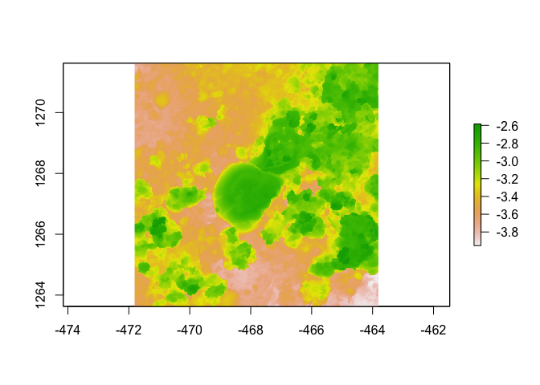

Assignment
================
2023-08-24

``` r
library(raster)
```

    ## Loading required package: sp

    ## The legacy packages maptools, rgdal, and rgeos, underpinning the sp package,
    ## which was just loaded, will retire in October 2023.
    ## Please refer to R-spatial evolution reports for details, especially
    ## https://r-spatial.org/r/2023/05/15/evolution4.html.
    ## It may be desirable to make the sf package available;
    ## package maintainers should consider adding sf to Suggests:.
    ## The sp package is now running under evolution status 2
    ##      (status 2 uses the sf package in place of rgdal)

``` r
library(habtools)
```

    ## 
    ## Attaching package: 'habtools'

    ## The following object is masked from 'package:raster':
    ## 
    ##     extent

``` r
library(ggplot2)
library(dplyr)
```

    ## 
    ## Attaching package: 'dplyr'

    ## The following objects are masked from 'package:raster':
    ## 
    ##     intersect, select, union

    ## The following objects are masked from 'package:stats':
    ## 
    ##     filter, lag

    ## The following objects are masked from 'package:base':
    ## 
    ##     intersect, setdiff, setequal, union

``` r
library(fishualize)

plot(horseshoe)
```

    ## Warning in sp::CRS(...): sf required for evolution_status==2L

    ## Warning in sp::CRS(...): sf required for evolution_status==2L

<!-- -->

Current lab Dr.Hunter-advisor Hadfield Lab GA

Project focus Temperature tolerance of native vs. invasive oyster larvae
in Pearl Harbor

Why you chose this course It sounds really interesting and I want to
learn R. Also, most of my research experience has focused in on the
small scale coral reef structure- looking at how and why invertebrate
larvae settle when/where they do, so I think it will be really cool to
look at structure/fuction on other levels.

What do you want to learn about the most in this course Similar to my
previous answer, I think it will be really interesting to learn about
the coral reef habitat from other perspectives. I am also excited to
learn about new technologies for learning about the reefs.

Your R experience none

Fun fact One time I got stranded at a Yodeling Festival in Switzerland.
